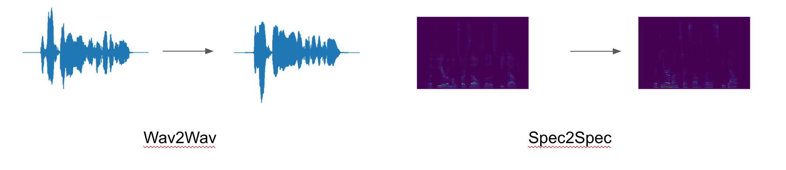

# S2SCycleGAN
The big idea is to create a voice conversion (VC) model using GANs.  
Two attempts were taken: direct application of SEGAN and a novel approach using the Tacotron TTS system.  Both raw audio VC and spectrogram VC were attempted.

Additionally, a cycle-consistency loss was included during training.  Nothing has been successful, yet, and detailed information can be found in the respective folders. Brief overviews of the attempts can be found here in the following subsections.

The idea of voice conversion using GANs (in fact, just deep learning) is a promising idea that is still in its nacency.  I hope this repo will serve as a starting point for others interested in the idea.

# Data 

Voice conversion was attempted using about 1200 paired utterances from two speakers (one male and one female).  The data comes for the CMU Artic dataset.  Download data with `downloadData.sh`, or get the data [here](https://www.dropbox.com/sh/ct3bbmerxckbzej/AABXpG8T4z1dUFdswchZABosa?dl=0).

# SEGAN
The SEGAN approach to VC is a direct application of methods described in the paper. where the noisy input was replaced with the one speaker and the clean audio was replaced with the other speaker.

# Tacotron GAN
In this approach, I tried to use components of the famous and mysterious TTS system Tacotron to create a VC model that was trained adversarially.  The implementation I used originated from [here](https://github.com/Kyubyong/tacotron).  The generator was a slightlty altered version of the original model that simply took linear-spectrogram audio as input.  The discrminator consisted of the encoder part of Tacotron with an additional FC layer that was fed the last state of the encoder.

One of the concerning points to this attempt was the lack of strong foundation for a the speech generator.  The model of Tacotron I used had not been fully vetted.  Thus, I spend the later half of ML Camp Jeju 2017 developing a strong implementation of this model.  You can follow my progress on this project [here](https://github.com/tmulc18/tacotron-1).

# Setup
1. Download the data with `sh downloadData.sh`
2. Install python dependencies into a new conda environment with `conda create -f env.yml`

### Port Audio and PyAudio

`sudo apt-get install libasound-dev`

`wget http://portaudio.com/archives/pa_stable_v190600_20161030.tgz`

`tar -zxvf pa_stable_v190600_20161030.tgz`

`cd portaudio`

`./configure && make`

`sudo make install`

`cd ..`

`source activate tensorflow1`

`pip install pyaudio`

# Future work
Deep learning is a promising avenue for speech synthesis, especially VC. As the foundation of speech synthesis solidify, I'll continue to attempt VC in a GAN setting in this repo.  The official list of action items is

- [x] Remove skip connections for SEGAN

- [ ] CycleGAN for Tacotron GAN

[//]:# (-[] Reattempt Tacotron GAN after good results)  

- [ ] Add speaker embedding and train both SEGAN and Tacotron GAN on OpenSLR

# References
1. Pascual, et al., "[SEGAN: Speech Enhancement Generative Adversarial Network](https://arxiv.org/abs/1703.09452)." March 2017

2. Wang, et al., "[Tacotron: Towards End-to-End Speech Synthesis](https://arxiv.org/abs/1703.10135)." March 2017

3. Zhu, et al., "[Unpaired Image-toImage Translation using Cycle-Consistent Adversarial Networks](https://arxiv.org/abs/1703.10593)." March 2017

