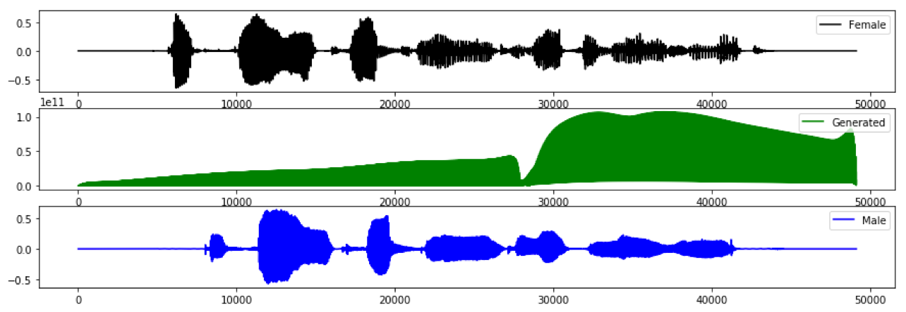
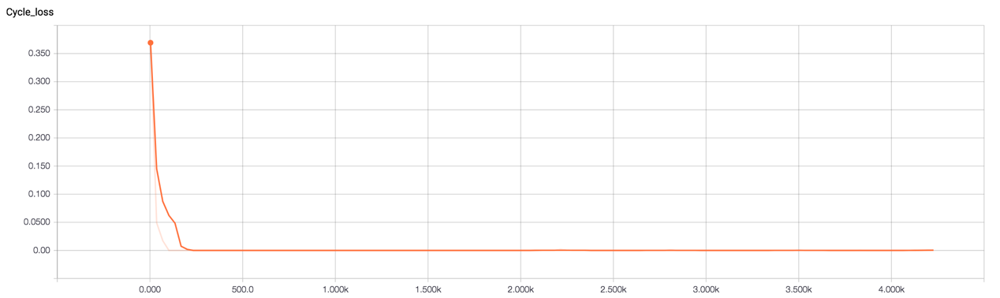
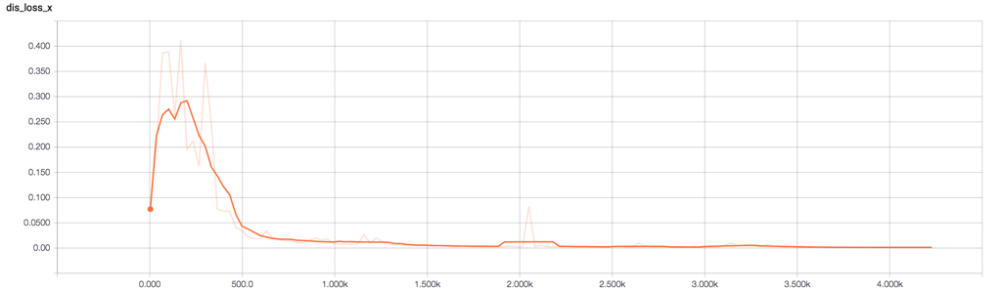
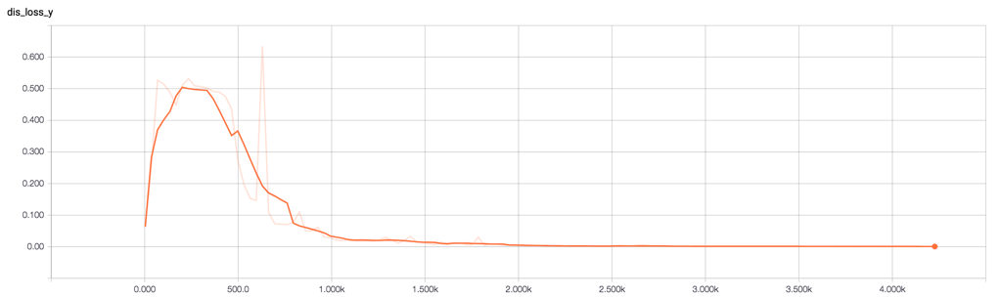
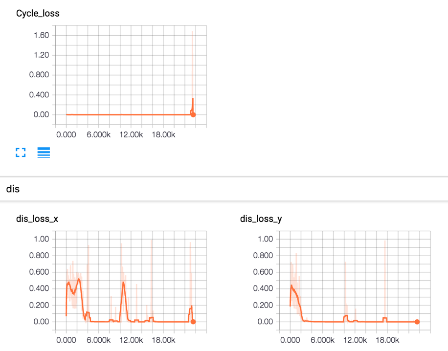

# SEGAN

A few variates were tried in an attempt to use SEGAN for a VC model

1. Raw audio I/O
2. Linear-scale Spectrogam I/O
3. Raw audio I/O and CycleGAN 
4. Raw audio I/O, cycle-consistency, no skip connections

## Results

So far, no meaningful audio.

## 3. Notes on Cycle-Consistency

When applying SEGAN with skip connections and usign the cycle consistency loss, it's very easy for both generators to learn the idenity in order to minize the cycle-consistency loss.

Of course, this leads to an easy task for the discriminators while the generator losses don't have enough weight to shift agenda.

More works needs to be done in investigating the weighting of the losses and the amount of time to train the generator.

## 4. Preliminary results from No skip connections

So far, removing the skip connections temporarily avoids the cycle consistency loss problem, until this loss explodes.  

