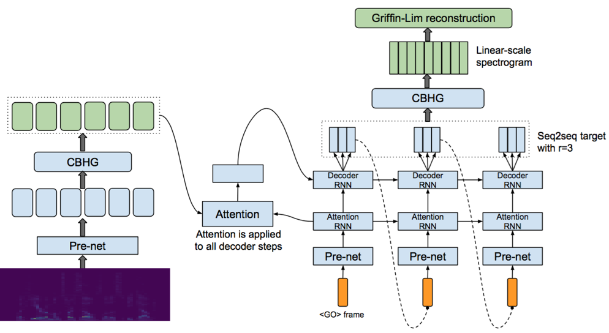

# Tacotron GAN

## Model Description
The general idea is that we want to be able to use the powerful Tacotron model in a GAN setting to translate sequences.  

The generator is almost exactly the Tacotron TTS model expect that it has linear-scale spectrograms as inputs and contains no character embedding. 

The descriminator is a model that has the architecure of the encoder except that it has linear-scale spectrograms as inputs and has one additionaly FC layer that receives the output of the last timestep from the GRU.

## Progress Summary
  * Started adversarial training
  * After reading the paper the Attention Mechanism should be Luong, and `eval.py` doesn't work when using multiple gpus.
  * Around 16 hours of training on gtx 1060 giving male mel-spec as input and having linear-scale and mel-scale as outputs yeilds this training curve.

The mel-scale and linear scale loss look like

The adverserial losses look like 

## File description
  * `hyperparams.py` includes all hyper parameters that are needed.
  * `prepro.py` creates sliced sound files from raw sound data, and constructs necessary information.
  * `prepro.py` loads vocabulary, training/evaluation data.
  * `data_load.py` loads data and put them in queues so multiple mini-bach data are generated in parallel.
  * `utils.py` has several custom operational functions.
  * `modules.py` contains building blocks for encoding/decoding networks.
  * `networks.py` has three core networks, that is, encoding, decoding, and postprocessing network.
  * `train.py` is for training on paired speech.
  * `train_gan.py` is for training advarsarially using LSGAN
  * `eval.py` is for sample synthesis.
  * `eval_gan.py` is  sample synthesis using gan_model
  

## Training
  * STEP 1. Adjust hyper parameters in `hyperparams.py` if necessary.
  * STEP 2. Download CMU Artic data.
  * STEP 3. Run `train.py`. or `train_multi_gpus.py` if you have more than one gpu.

## Sample Synthesis
  * Run `eval_gan.py` to get samples.

### Acknowledgements
I would like to show my respect to Ryan, the author of almost all the tacotron code.
